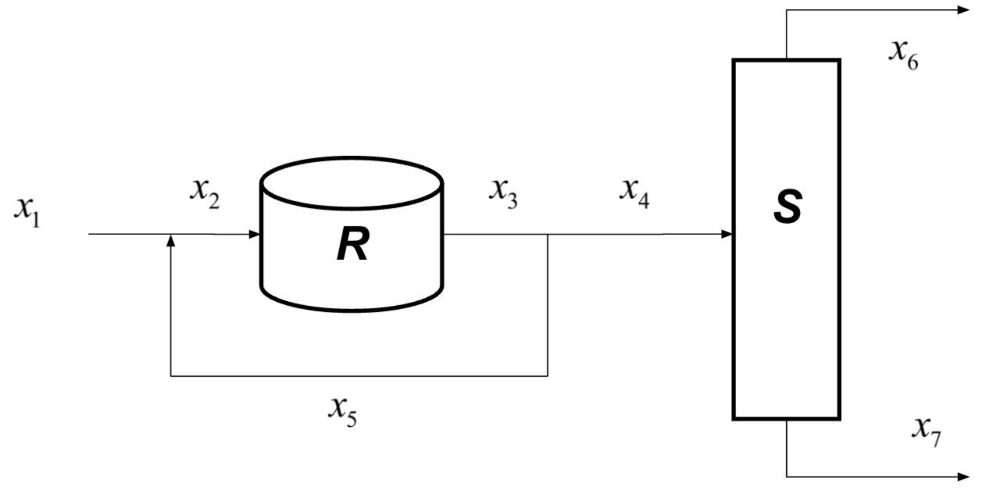

# Linear Systems

```python
import numpy as np
```

## Mole/Mass Balance



Set up the mole balance equations for this PFD, given that $R$, $S$ operate so $x_3 = R x_2$ and $x_6 + x_7 = S x_4$. Then arrange in the form $Ax = b$.

$$\begin{bmatrix}
    -1 & 1 & 0 & 0 & -1 & 0 & 0 \\
    0 & -R & 1 & 0 & 0 & 0 & 0 \\
    0 & 0 & 1 & -1 & -1 & 0 & 0 \\
    0 & 0 & 0 & S & 0 & -1 & -1 \\
\end{bmatrix}
\begin{bmatrix}
    x_1 \\
    x_2 \\
    x_3 \\
    x_4 \\
    x_5 \\
    x_6 \\
    x_7 \\
\end{bmatrix}
= \begin{bmatrix}
    0 \\
    0 \\
    0 \\
    0 \\
\end{bmatrix}$$

## Problem 4

Write a function `my_make_lin_ind(A)`, where `A` and `B` are matrices. Let the `rank(A) = n`. Then `B` should be a matrix containing the first `n` columns of `A` that are all linearly independent. Note that this implies that `B` is full rank.

```python
import copy
from math import isclose

def my_make_lin_ind(A):
    B = []
    for jA in range(len(A[0])):
        B.append(A[:, jA])
        n, m = len(B), len(B[0])
        C = copy.deepcopy(B)
        for i in range(n):
            if isclose(C[i][i], 0):
                for jC in range(i + 1, n):
                    if not isclose(C[jC][i], 0):
                        C[i], C[jC] = C[jC], C[i]
                        break
            if isclose(C[i][i], 0):
                continue
            for jC in range(i + 1, n):
                x = C[jC][i] / C[i][i]
                for k in range(i, m):
                    C[jC][k] -= x * C[i][k]
        if sum(any(row) for row in C) != len(B):
            B.pop()
    return list(zip(*B))

## Test cases for problem 4
A = np.array([[12,24,0,11,-24,18,15], 
              [19,38,0,10,-31,25,9], 
              [1,2,0,21,-5,3,20],
              [6,12,0,13,-10,8,5],
              [22,44,0,2,-12,17,23]])

B = my_make_lin_ind(A)

# B = [[12,11,-24,15],
#      [19,10,-31,9],
#      [1,21,-5,20],
#      [6,13,-10,5],
#      [22,2,-12,23]]
print(B)
```

```
[(12, 11, -24, 18, 15), (19, 10, -31, 25, 9), (1, 21, -5, 3, 20), (6, 13, -10, 8, 5), (22, 2, -12, 17, 23)]
```

## $Ly = b$

Solve for $y$ if $Ly = b$. It should only take O($n^2$) $\approx$ 9 flops.

$$\begin{array}{|l|l|}
    \hline
    L = \begin{bmatrix}
        1 & 0 & 0 \\
        2 & 4 & 0 \\
        5 & 2 & 3 \\
    \end{bmatrix} & b = \begin{bmatrix}
        0 \\
        4 \\
        6 \\
    \end{bmatrix} \\
    \hline
    L = \begin{bmatrix}
        1 & 0 & 0 \\
        0 & 4 & 0 \\
        5 & 2 & 3 \\
    \end{bmatrix} & b = \begin{bmatrix}
        0 \\
        4 \\
        6 \\
    \end{bmatrix} \\
    \hline
    L = \begin{bmatrix}
        1 & 0 & 0 \\
        0 & 1 & 0 \\
        5 & 2 & 3 \\
    \end{bmatrix} & b = \begin{bmatrix}
        0 \\
        1 \\
        6 \\
    \end{bmatrix} \\
    \hline
    L = \begin{bmatrix}
        1 & 0 & 0 \\
        0 & 1 & 0 \\
        0 & 2 & 3 \\
    \end{bmatrix} & b = \begin{bmatrix}
        0 \\
        1 \\
        6 \\
    \end{bmatrix} \\
    \hline
    L = \begin{bmatrix}
        1 & 0 & 0 \\
        0 & 1 & 0 \\
        0 & 0 & 3 \\
    \end{bmatrix} & b = \begin{bmatrix}
        0 \\
        1 \\
        4 \\
    \end{bmatrix} \\
    \hline
    L = \begin{bmatrix}
        1 & 0 & 0 \\
        0 & 1 & 0 \\
        0 & 0 & 1 \\
    \end{bmatrix} & b = \begin{bmatrix}
        0 \\
        1 \\
        \frac{4}{3} \\
    \end{bmatrix} \\
\end{array}$$

## Vector Norms

Find the 1-norm, 2-norm (Euclidean norm), and the infinity-norm of the following vectors:

```python
import math

x = [[1], [4], [9], [1], [15]]
y = [[2], [0], [-7], [0], [0]]
one_norm = lambda vector: sum(sum(abs(column) for column in row) for row in z)
two_norm = lambda vector: math.sqrt(sum(sum(column**2 for column in row) for row in z))
infinity_norm = lambda x: max(max(abs(column) for column in row) for row in z)
print(f'x: 1-norm = {one_norm(x)}, 2-norm = {two_norm(x)}, infinity-norm = {infinity_norm(x)}')
print(f'y: 1-norm = {one_norm(y)}, 2-norm = {two_norm(y)}, infinity-norm = {infinity_norm(y)}')
```

```
x: 1-norm = 30, 2-norm = 18.0, infinity-norm = 15
y: 1-norm = 9, 2-norm = 7.280109889280518, infinity-norm = 7
```